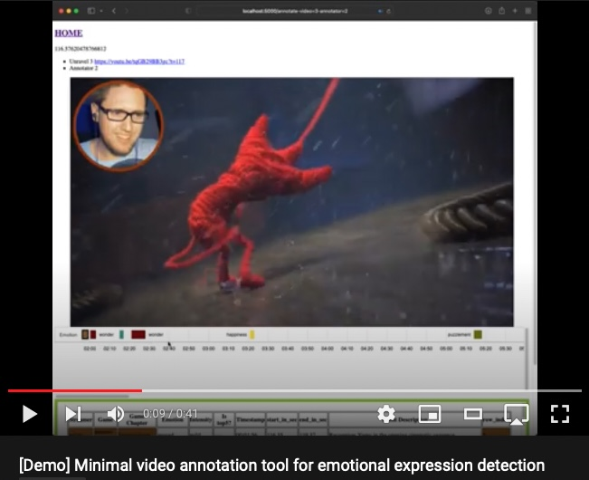

# Minimal Video Labeling Tool
Without any manual.

[](https://youtu.be/l8dvMfeqzmM)

## What it does
- Label emotional expression range
- Navigate frames one by one with keystrokes. Refer to JS scripts for details.
- Jump to emotional segments interactively.
- Python Flask for back-end. JS for front-end.

## System requirements
- Ubuntu 16.04+
- Intel Macs (I couldn't run it on M1s.)
- Python 3.6+
## Installation
```console
$ ./shell-init.sh
$ source venv/bin/activate
(venv) $ python3 main.py
.........
Server will run at localhost:5000
```
Go to http://localhost:5000

## Try it
1. Download https://youtu.be/tqGB29BB3gc using `Youtube-dl` Name it `unravel3.mp4`.
2. Place it in `static/unravel3/unravel3.mp4`.
3. Go to http://localhost:5000/annotate-video=3-annotator=2.